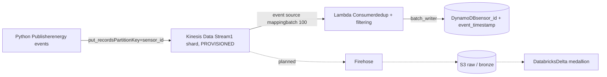

# AWS Realtime Pipelines

Real-time energy sensor ingestion platform on AWS — Kinesis, Lambda, DynamoDB, 
fully provisioned with Terraform.

> Learning-in-public project: production-grade patterns (IaC, least-privilege IAM, 
> idempotent writes, CI-ready tests) applied to a realistic energy use case.

## Architecture

## What this demonstrates

- **Streaming ingestion**: at-least-once delivery handled with intra-batch dedup 
  (Lambda) + idempotent writes (DynamoDB composite key)
- **Data quality at ingestion**: negative readings filtered, malformed payloads 
  rejected without blocking the shard (poison-pill protection)
- **Infrastructure as Code**: reusable Terraform modules, remote S3 state with 
  native locking, one-command teardown/rebuild
- **Security**: least-privilege IAM (per-resource ARNs, scoped deployer policies)

## Project structure
[l'arborescence en 10 lignes, tu la connais]

## Quickstart
[prérequis + les 4 commandes : terraform apply, publisher, vérif scan, destroy]

## Roadmap
- [x] Hot path: Kinesis → Lambda → DynamoDB
- [ ] API Gateway: query KPIs per sensor
- [ ] Cold path: Firehose → S3 → Databricks (Delta medallion)
- [ ] Dedicated infra repo with per-stack state isolation